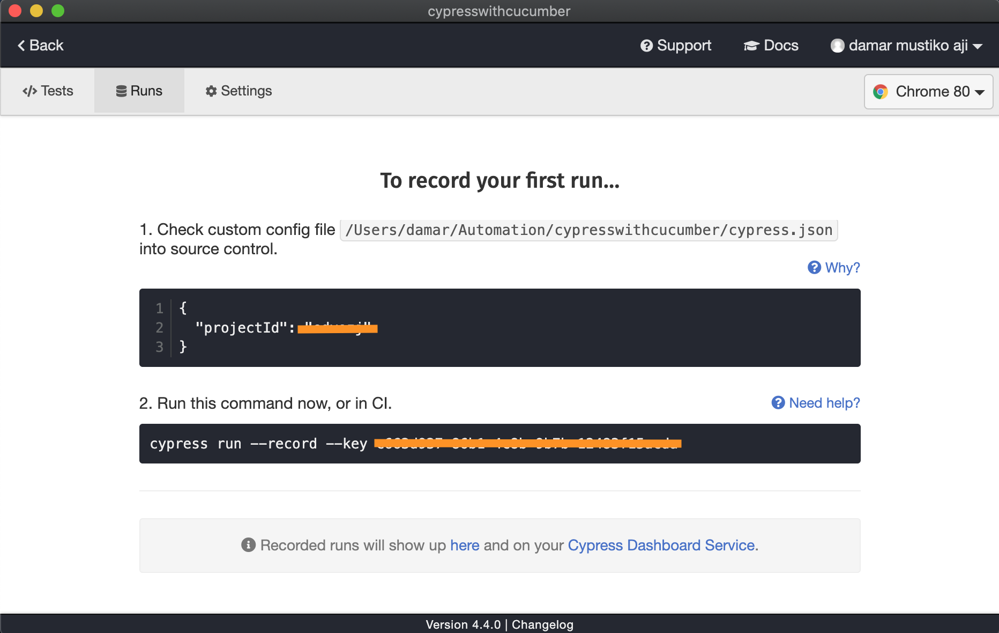

### [Back](../)

### Set Up Project Cypress

Setup project cypress dengan melakukan login terlebih dahulu menggunakan account Gmail atau Github, kemudian fitur setup project akan terlihat di tab Runs pada Cypress Desktop. Setelah proses setup akan mendapatkan project ID dan key record yang nanti bisa digunakan untuk memanfaatkan fitur reporter di cypress dashboard online. [How to generate report](Report.md)




1. Go to `cypress.json` > projectId

```json
{
  "projectId": "abcx123",
  "defaultCommandTimeout": 60000,
  "animationDistanceThreshold": 5,
  "baseUrl": null,
  "blacklistHosts": null,
  "chromeWebSecurity": false,
  "env": {},
```

2. Go to `packge.json` > scripts

```json
  "scripts": {
    "test-webui": "npm run clean-reports & ./node_modules/.bin/cypress-tags run --spec \"cypress/integration/*.feature\" --record --key 123-456-789-10"
  },
```