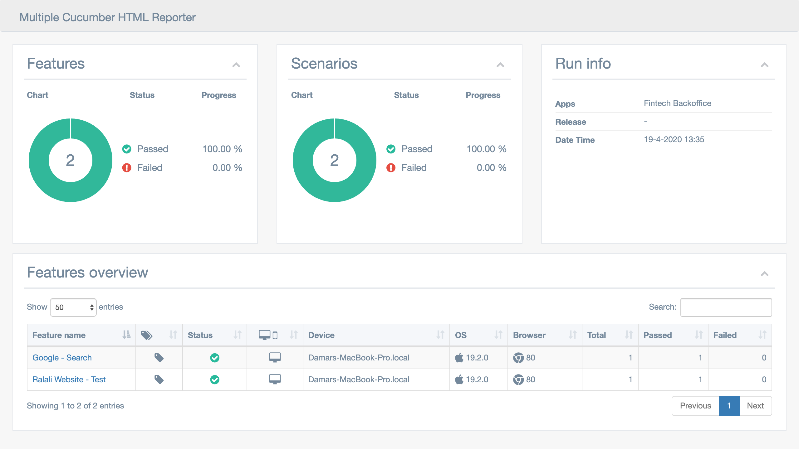
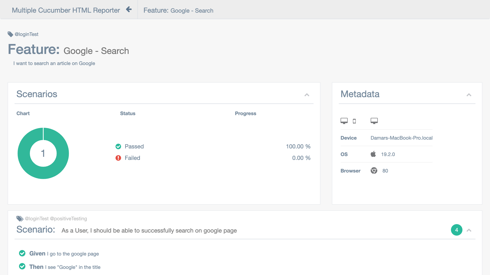
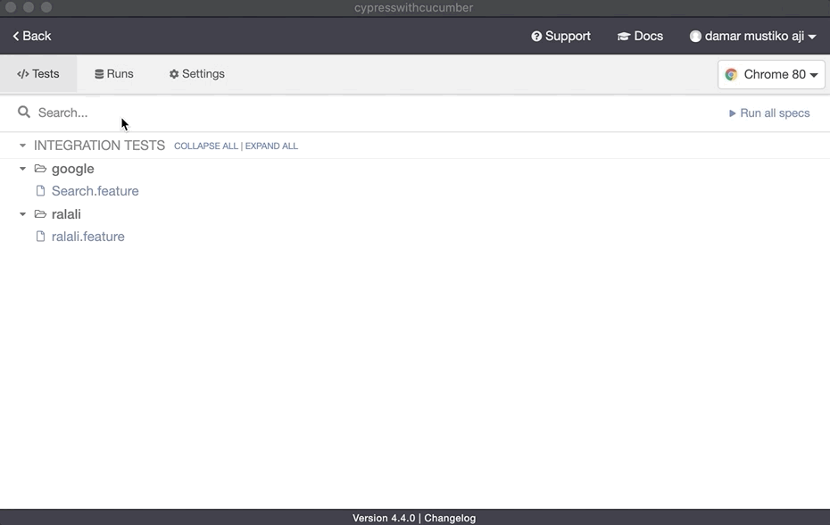

### [Back](../)

## Report

Reporter menggunakan 2 tipe:
1. Module `multiple-cucumber-html-reporter` untuk report secara local dengan file json dan html
2. Recorder Cypres yang otomatis diupload ke dashboard cypress (limitation record)

## Multiple-cucumber-html-report

Menggunakan file `cypress/cypress_report.js` yang dijalankan dengan perintah:
```sh
$ npm run reports
```

Kemudian untuk menampilkan di file html report di browser dengan:
```sh
$ npm run open-reports
```





## Cypress Dashboard



please visit cypress dashboard `https://dashboard.cypress.io/projects/[projectId]/runs`


#### [How to Setup Project ID Cypress](ProjectID_Cypress.md)
